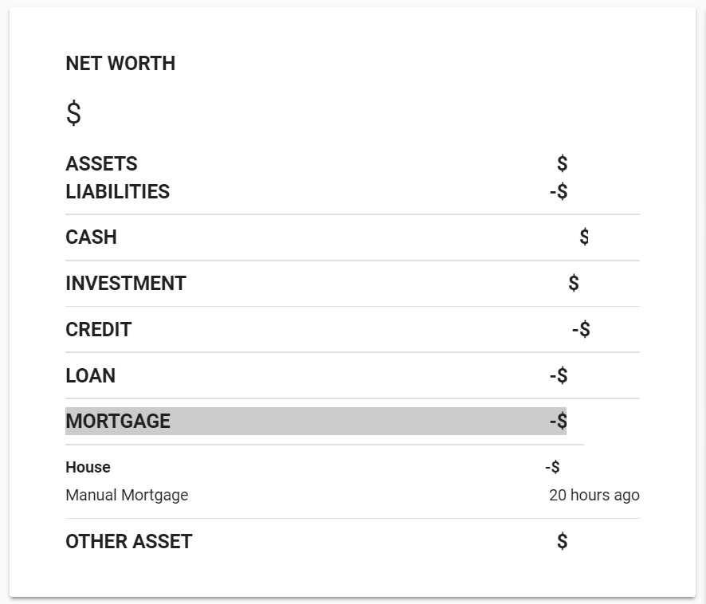

# Personal Capital Card
💵 Personal Capital Lovelace Card

[![GitHub Release][releases-shield]][releases]
[![License][license-shield]](LICENSE.md)

![Project Maintenance][maintenance-shield]
[![GitHub Activity][commits-shield]][commits]

[![Discord][discord-shield]][discord]
[![Community Forum][forum-shield]][forum]

[![Twitter][twitter]][twitter]
[![Github][github]][github]

## Support
Hey dude! Help me out for a couple of :beers: or a :coffee:!

[](https://www.buymeacoffee.com/zJtVxUAgH)

This card is for [Lovelace](https://www.home-assistant.io/lovelace) on [Home Assistant](https://www.home-assistant.io/) that display account data from the [sensor.personalcapital](https://github.com/custom-components/sensor.personalcapital) custom component.

# NOTE: Firefox releases before 67 are not supported
https://twitter.com/_developit/status/1090364879377260544



## Options

| Name | Type | Requirement | Description
| ---- | ---- | ------- | -----------
| type | string | **Required** | `custom:pc-card`
| title | string | **Optional** | Card title

## Installation

### Step 1

Save [pc-card](https://github.com/custom-cards/pc-card/raw/master/pc-card.js) to `<config directory>/www/pc-card.js` on your Home Assistant instanse.

**Example:**

```bash
wget https://raw.githubusercontent.com/custom-cards/pc-card/master/pc-card.js
mv pc-card.js /config/www/
```

### Step 2

Link `pc-card` inside your `ui-lovelace.yaml`.

```yaml
resources:
  - url: /local/pc-card.js?v=0
    type: module
```

### Step 3

Add a custom element in your `ui-lovelace.yaml`

```yaml
      - type: custom:pc-card
        title: Money
```

[Troubleshooting](https://github.com/thomasloven/hass-config/wiki/Lovelace-Plugins)

[commits-shield]: https://img.shields.io/github/commit-activity/y/custom-cards/pc-card.svg?style=for-the-badge
[commits]: https://github.com/custom-cards/pc-card/commits/master
[discord]: https://discord.gg/Qa5fW2R
[discord-shield]: https://img.shields.io/discord/330944238910963714.svg?style=for-the-badge
[forum-shield]: https://img.shields.io/badge/community-forum-brightgreen.svg?style=for-the-badge
[forum]: https://community.home-assistant.io/t/lovelace-personal-capital-component-card/91463
[license-shield]: https://img.shields.io/github/license/custom-cards/pc-card.svg?style=for-the-badge
[maintenance-shield]: https://img.shields.io/badge/maintainer-Ian%20Richardson%20%40iantrich-blue.svg?style=for-the-badge
[releases-shield]: https://img.shields.io/github/release/custom-cards/pc-card.svg?style=for-the-badge
[releases]: https://github.com/custom-cards/pc-card/releases
[twitter]: https://img.shields.io/twitter/follow/iantrich.svg?style=social
[github]: https://img.shields.io/github/followers/iantrich.svg?style=social
